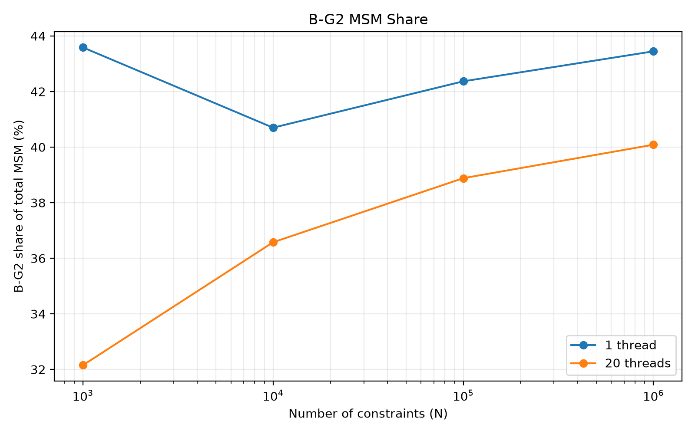

# Groth16 Baseline

A reproducible experimental baseline for the Groth16 zkSNARK proving system.

This repository is intended to serve as a controlled experimental foundation
for Groth16 prover profiling, computational-cost analysis, and subsequent
optimization research.

---

## Research Objective

The primary goal of this repository is to understand the computational cost
of the Groth16 proving system and use reproducible measurements to identify
concrete optimization targets.

The current experiments cover:

- Setup Time
- Witness Generation Time
- Verifying-Key Preparation Time
- Prove Time
- Verify Time
- Proof Size
- Peak Working Set
- Constraint Scaling
- Coarse-Grained Prover Profiling
- Fine-Grained MSM Profiling
- MSM Microbenchmark
- FFT / IFFT Microbenchmark
- Parallel Speedup

The long-term research objective is to investigate methods for:

- reducing prover computation;
- reducing memory or communication cost;
- improving parallel efficiency;
- improving implementation-level efficiency;
- identifying practical opportunities for Groth16 optimization.

The repository is organized so that future optimization results can be compared
against the same baseline under controlled experimental conditions.

---

# Experimental Environment

| Item | Value |
|---|---|
| CPU | Intel Core i7-14700 |
| Physical Cores | 20 |
| Logical Processors | 28 |
| RAM | 32 GB |
| OS | Windows 11 Home China Insider Preview |
| OS Version | 25H2 |
| OS Build | 26220.9568 |
| Rust | 1.98.1 |
| Target | x86_64-pc-windows-msvc |
| Arkworks | 0.6.0 |
| Curve | BN254 |
| Scalar Field | BN254 Fr |
| Build | Release |
| Formal Rayon Threads | 1 / 20 |

The benchmark experiments are performed on the same physical machine unless
otherwise stated.

---

# Benchmark Methodology

Unless otherwise specified, timing experiments use:

- Release build
- 2 warm-up runs
- 5 formal measurement runs
- Median used for timing summaries
- BN254
- Repeated-squaring benchmark circuit

Warm-up runs are excluded from formal timing statistics.

The experiments are organized into three levels:

1. End-to-end baseline measurements
2. Coarse-grained Groth16 prover profiling
3. Fine-grained primitive-level profiling

Measurements collected in different experimental runs are treated as
independent datasets. Their absolute timing values are not expected to be
identical because runtime conditions can vary between runs.

Proof size is measured after compressed serialization.

Peak Working Set is measured separately as a memory metric and is not included
in timing medians.

---

# Baseline Results

The current end-to-end Groth16 baseline results are:

| Constraints | Setup (ms) | Witness (ms) | Prepare VK (ms) | Prove (ms) | Verify (ms) | Proof (B) | Peak Memory (MB) |
|---:|---:|---:|---:|---:|---:|---:|---:|
| 1,000 | 11.242 | 0.023 | 1.050 | 20.394 | 1.128 | 128 | 11.29 |
| 10,000 | 61.102 | 0.162 | 0.928 | 80.503 | 0.976 | 128 | 23.46 |
| 100,000 | 442.122 | 1.533 | 0.845 | 481.373 | 0.857 | 128 | 114.75 |
| 1,000,000 | 6236.741 | 34.445 | 1.168 | 6394.521 | 1.335 | 128 | 892.23 |

The end-to-end baseline shows two main characteristics:

1. The compressed Groth16 proof remains constant at 128 bytes across the tested
   circuit sizes.
2. Setup and proving costs increase substantially as the number of constraints
   grows.


---

# Groth16 Prover Profiling

The repository also contains coarse-grained profiling of the
`ark-groth16` prover implementation.

The profiling uses the same repeated-squaring circuit and evaluates:

- 1,000 constraints
- 10,000 constraints
- 100,000 constraints
- 1,000,000 constraints

Each scale uses:

- 2 warm-up runs
- 5 formal measurement runs
- Release configuration

The major prover stages are:

```text
Constraint synthesis
        ↓
Inlining LCs
        ↓
R1CS to QAP witness map
        ↓
Compute C
        ↓
Compute A
        ↓
Compute B in G1
        ↓
Compute B in G2
        ↓
Finish C
```

These are coarse-grained implementation stages rather than instruction-level
measurements.

In particular, `Compute A`, `Compute B in G1`, `Compute B in G2`, and
`Compute C` can contain multiple group operations and MSM-related operations.
They should therefore not be interpreted as pure MSM measurements.

## Coarse-Grained Profiling Results

| Constraints (N) | Prove (ms) | QAP (ms) | Compute C (ms) | Compute A (ms) | Compute B-G1 (ms) | Compute B-G2 (ms) | Verify (ms) | Proof Size (B) |
|---:|---:|---:|---:|---:|---:|---:|---:|---:|
| 1,000 | 21.244 | 3.139 | 5.990 | 3.066 | 2.898 | 5.476 | 1.049 | 128 |
| 10,000 | 77.647 | 11.895 | 22.599 | 9.071 | 9.154 | 22.408 | 1.410 | 128 |
| 100,000 | 450.286 | 76.869 | 120.248 | 52.133 | 51.586 | 138.594 | 1.046 | 128 |
| 1,000,000 | 4,024.170 | 681.383 | 978.854 | 478.513 | 547.475 | 1,284.000 | 1.018 | 128 |

At larger circuit sizes, `Compute B in G2`, `Compute C`, and
`R1CS to QAP witness map` are important observed components of prover
execution time.

These measurements motivate finer-grained analysis but do not, by themselves,
establish a definitive algorithmic bottleneck.

Processed profiling data:

- [`prover_summary.csv`](results/tables/prover_summary.csv)
- [`prover_stage_share.csv`](results/tables/prover_stage_share.csv)
- [`prover_scaling.csv`](results/tables/prover_scaling.csv)
- [`prover_summary.md`](results/tables/prover_summary.md)

Figures:

- [`prover_time_vs_constraints.png`](results/figures/prover_time_vs_constraints.png)
- [`prover_stage_breakdown.png`](results/figures/prover_stage_breakdown.png)
- [`prover_stage_share.png`](results/figures/prover_stage_share.png)

---

# Day 11: MSM / FFT Microbenchmark

Day 11 extends the coarse-grained prover profiling with fine-grained
microbenchmarks for two important primitive classes:

- Multi-Scalar Multiplication (MSM)
- FFT / IFFT over the BN254 scalar field

The purpose is to connect primitive-level behavior with the system-level
behavior observed in the Groth16 prover.

The resulting analysis pipeline is:

```text
End-to-End Baseline
        ↓
Coarse-Grained Prover Profiling
        ↓
MSM / FFT Microbenchmark
        ↓
Primitive-Level Cost Analysis
        ↓
Optimization Target Identification
```

---

## MSM Microbenchmark

The standalone MSM microbenchmark evaluates variable-base MSM over BN254 G1
and G2.

The formal standalone MSM measurements use:

```text
N = 2^10
N = 2^12
N = 2^14
N = 2^16
```

and compare:

- G1 / G2
- 1 thread / 20 threads

The raw standalone MSM measurements are stored in:

```text
experiments/raw/microbench/
```

including:

```text
msm_g1.csv
msm_g2.csv
```

The corresponding figures are:

- [`msm_microbench.png`](results/figures/msm_microbench.png)
- [`msm_speedup.png`](results/figures/msm_speedup.png)

---

## Groth16 Prover Internal MSM Breakdown

To determine whether MSM is responsible for the observed Groth16 prover cost,
the `ark-groth16` prover implementation was instrumented to measure five
concrete MSM operations:

```text
MSM C-H
MSM C-L
MSM A
MSM B-G1
MSM B-G2
```

The raw measurements are stored separately from processed results:

```text
experiments/raw/msm_trace/msm_breakdown.csv
```

The formal experiment covers:

```text
N = 1,000
N = 10,000
N = 100,000
N = 1,000,000
```

with:

```text
threads = 1
threads = 20
```

and:

```text
2 warm-up runs
5 formal runs
median used for summary
```

Exploratory measurements collected with `threads=default` remain in the raw
dataset but are excluded from the formal 1-thread / 20-thread comparison.

---

## Fine-Grained MSM Results

The current formal summary is:

| N | Threads | Prove (ms) | MSM Total (ms) | MSM / Prove | B-G2 / MSM |
|---:|---:|---:|---:|---:|---:|
| 1,000 | 1 | 52.836 | 48.916 | 92.6% | 43.6% |
| 1,000 | 20 | 22.286 | 15.772 | 70.8% | 32.2% |
| 10,000 | 1 | 394.757 | 364.754 | 92.4% | 40.7% |
| 10,000 | 20 | 85.842 | 68.736 | 80.1% | 36.6% |
| 100,000 | 1 | 2956.466 | 2707.039 | 91.6% | 42.4% |
| 100,000 | 20 | 488.295 | 403.520 | 82.6% | 38.9% |
| 1,000,000 | 1 | 24113.191 | 21715.134 | 90.1% | 43.4% |
| 1,000,000 | 20 | 3952.734 | 3254.899 | 82.3% | 40.1% |

The processed tables are:

- [`msm_breakdown_summary.csv`](results/tables/msm_breakdown_summary.csv)
- [`msm_speedup.csv`](results/tables/msm_speedup.csv)

---

## MSM Findings

### MSM is a dominant prover cost

For the single-thread measurements, MSM accounts for approximately:

```text
90.1% – 92.6%
```

of prover time across the tested range from 1,000 to 1,000,000 constraints.

Even under 20-thread execution, MSM remains a major component:

```text
70.8% – 82.6%
```

of prover time.

Therefore, MSM is a primary computational component of the current prover
implementation rather than a minor auxiliary operation.

### B-G2 is the largest individual MSM component

B-G2 MSM is consistently the most expensive individual MSM operation.

At larger circuit scales, B-G2 contributes approximately 40% of total MSM
time.

This identifies B-G2 MSM as an important candidate for subsequent
investigation.

### MSM parallel speedup

The measured 1-thread to 20-thread speedup is:

| Constraints | MSM Speedup | Prover Speedup |
|---:|---:|---:|
| 1,000 | 3.10x | 2.37x |
| 10,000 | 5.31x | 4.60x |
| 100,000 | 6.71x | 6.05x |
| 1,000,000 | 6.67x | 6.10x |

The MSM speedup increases as the workload becomes larger and approaches
approximately 6.7x at 100,000–1,000,000 constraints.

This is substantially below ideal linear scaling of 20x.

The measurements demonstrate the presence of non-ideal scaling effects, but do
not by themselves determine whether the limiting factors are scheduling,
memory behavior, workload structure, arithmetic costs, or other
implementation-level effects.

---

## MSM Figures





These figures show:

1. MSM time growth with circuit size;
2. 1-thread to 20-thread speedup;
3. B-G2 contribution to total MSM time;
4. MSM contribution to total prover time.

---

# FFT / IFFT Microbenchmark

The FFT microbenchmark evaluates forward and inverse transforms over the BN254
scalar field `Fr`.

The tested evaluation-domain sizes are:

```text
2^10  = 1,024
2^12  = 4,096
2^14  = 16,384
2^16  = 65,536
```

Both forward FFT and inverse FFT are measured under:

```text
1 thread
20 threads
```

Each configuration uses:

```text
2 warm-up runs
5 formal runs
median used for summary
```

Raw measurements are stored in:

```text
experiments/raw/microbench/fft.csv
```

---

## FFT Results

| N | Forward 1T (ms) | Forward 20T (ms) | Inverse 1T (ms) | Inverse 20T (ms) |
|---:|---:|---:|---:|---:|
| 1,024 | 0.138 | 0.306 | 0.151 | 0.455 |
| 4,096 | 0.700 | 0.761 | 0.703 | 0.823 |
| 16,384 | 2.798 | 1.171 | 2.932 | 1.252 |
| 65,536 | 11.872 | 2.790 | 12.955 | 3.083 |

Processed tables:

- [`fft_summary.csv`](results/tables/fft_summary.csv)
- [`fft_speedup.csv`](results/tables/fft_speedup.csv)

---

## FFT Parallel Speedup

The measured speedups are:

| N | Forward FFT Speedup | Inverse FFT Speedup |
|---:|---:|---:|
| 1,024 | 0.451x | 0.332x |
| 4,096 | 0.920x | 0.854x |
| 16,384 | 2.389x | 2.342x |
| 65,536 | 4.255x | 4.202x |

Here:

```text
Speedup = T_1thread / T_20threads
```

Therefore:

- speedup < 1 means 20-thread execution is slower;
- speedup ≈ 1 means there is little measurable benefit;
- speedup > 1 means parallel execution provides measurable benefit.

The experiment shows that small FFT workloads do not necessarily benefit from
many threads.

At:

```text
N = 1,024
N = 4,096
```

the parallel overhead is large relative to the amount of FFT work.

At:

```text
N = 16,384
N = 65,536
```

the workload becomes large enough for parallel execution to provide increasing
benefit.

This demonstrates that parallel performance depends on workload size as well
as algorithmic complexity.

---

## FFT Figures


- [`fft_parallel_speedup.png`](results/figures/fft_parallel_speedup.png)

---

# Day 11 Bottleneck Analysis

Day 11 connects the system-level profiling from the previous stage with
primitive-level microbenchmark results.

The coarse-grained prover profiling showed that prover cost increases
substantially with circuit size and that the major execution stages include
QAP processing and the A/B/C computation phases.

The fine-grained MSM measurements then showed that the measured MSM operations
account for approximately 90% or more of prover time in the single-thread
experiments across the tested range from 1,000 to 1,000,000 constraints.

Even with 20-thread execution, MSM remains a major part of prover runtime.

Among the five measured MSM operations, B-G2 is consistently the largest
individual component and contributes roughly 40% of total MSM time at larger
scales.

The FFT microbenchmark provides a useful contrast. FFT / IFFT execution is
substantially faster in the tested range, and its parallel benefit depends
strongly on workload size. At N=1,024 and N=4,096, 20-thread execution is
actually slower than single-thread execution. At N=16,384 and N=65,536,
parallel execution becomes increasingly effective.

These results lead to three important conclusions.

First, MSM is the current low-level hotspot that deserves priority in further
Groth16 prover analysis.

Second, B-G2 MSM is a particularly important sub-component to investigate.

Third, local primitive-level speedups cannot be directly translated into the
same percentage improvement for the complete prover. If one primitive is made
50% faster, the whole prover does not necessarily become 50% faster because
the remaining stages still contribute to total execution time.

Therefore, the next optimization stage should first determine the concrete
implementation-level causes of MSM cost and parallel-scaling limitations
before introducing an optimization.

---

# Important Interpretation Notes

## Local speedup is not system-wide speedup

A local primitive becoming 50% faster does not imply that the entire prover
becomes 50% faster.

The end-to-end benefit depends on:

- the fraction of total execution time occupied by that primitive;
- the amount of work remaining outside the optimized primitive;
- interactions between computation, memory, and parallel execution.

All optimization claims should therefore include both local microbenchmark
results and end-to-end prover measurements.

## Empirical scaling is not theoretical complexity

The timing curves in this repository describe the behavior of the current
implementation under the tested experimental conditions.

Measured scaling trends should not be interpreted as the theoretical algorithmic
complexity of MSM or FFT.

## Hardware and implementation matter

The same mathematical operation can exhibit substantially different
performance because of:

- CPU architecture;
- physical versus logical cores;
- cache and memory hierarchy;
- memory bandwidth;
- SIMD/vectorization;
- thread scheduling;
- parallel-runtime overhead;
- finite-field implementation;
- elliptic-curve implementation;
- MSM windowing strategy;
- data layout.

Therefore, benchmark results should always be reported together with the
hardware, software version, curve, field, thread configuration, and benchmark
methodology.

## Different experimental stages are not numerically interchangeable

The original end-to-end baseline, coarse-grained prover profiling, and
fine-grained MSM profiling are separate experimental datasets.

The absolute timing values may therefore differ even for the same circuit size.

The analysis focuses on reproducible trends and relative contributions rather
than assuming that independent benchmark runs must produce identical absolute
timings.

---

# Repository Structure

```text
groth16-baseline/
├── docs/
│   ├── environment.md
│   ├── methodology.md
│   |── bottleneck_analysis.md
|   └── msm_analysis.md
│
├── experiments/
│   ├── configs/
│   └── raw/
│       ├── auxiliary/
│       ├── baseline_n*.csv
│       ├── memory_n*.err
│       ├── peak_memory.csv
│       ├── prover_n*.csv
│       ├── prover_n*.err
│       ├── microbench/
│       │   ├── msm_g1.csv
│       │   ├── msm_g2.csv
│       │   └── fft.csv
│       └── msm_trace/
│           └── msm_breakdown.csv
│
├── results/
│   ├── figures/
│   │   ├── prove_time_vs_constraints.png
│   │   ├── prover_time_vs_constraints.png
│   │   ├── prover_stage_breakdown.png
│   │   ├── prover_stage_share.png
│   │   ├── msm_microbench.png
│   │   ├── msm_speedup.png
│   │   ├── msm_time_scaling.png
│   │   ├── msm_parallel_speedup.png
│   │   ├── msm_prover_ratio.png
│   │   ├── b_g2_msm_share.png
│   │   ├── fft_time_scaling.png
│   │   └── fft_parallel_speedup.png
│   │
│   └── tables/
│       ├── baseline_summary.csv
│       ├── prover_summary.csv
│       ├── prover_summary.md
│       ├── prover_stage_share.csv
│       ├── prover_scaling.csv
│       ├── msm_breakdown_summary.csv
│       ├── msm_speedup.csv
│       ├── fft_summary.csv
│       └── fft_speedup.csv
│
├── scripts/
│   ├── plot_baseline.py
│   ├── plot_prover_profile.py
│   ├── analyze_msm.py
│   ├── analyze_fft.py
│   └── requirements.txt
│
├── src/
│   ├── bin/
│   │   ├── microbench.rs
│   │   ├── fft_microbench.rs
│   │   └── inspect_sizes.rs
│   ├── benchmark.rs
│   ├── circuit.rs
│   ├── groth16.rs
│   └── main.rs
│
├── vendor/
│   └── ark-groth16/
│
├── Cargo.toml
├── Cargo.lock
├── README.md
└── rust-toolchain.toml
```

---

# Data Management

The repository intentionally separates raw measurements from processed results.

```text
experiments/raw/
        ↓
Raw Experimental Data
        ↓
results/tables/
        ↓
Processed and Summarized Data
        ↓
results/figures/
        ↓
Generated Figures
```

The intended rules are:

- `experiments/raw/` contains original experimental measurements;
- `results/tables/` contains processed and summarized data;
- `results/figures/` contains generated figures;
- `docs/` contains methodology, interpretation, and research notes.

Raw experimental data should not be replaced by processed results.

---

# Reproducing the End-to-End Baseline

Set the Rayon thread count explicitly when reproducing the formal parallel
configuration:

```powershell
$env:RAYON_NUM_THREADS=20
```

Then run:

```powershell
cargo run --release --bin groth16-baseline -- bench 1000 2 5
cargo run --release --bin groth16-baseline -- bench 10000 2 5
cargo run --release --bin groth16-baseline -- bench 100000 2 5
cargo run --release --bin groth16-baseline -- bench 1000000 2 5
```

For the single-thread configuration:

```powershell
$env:RAYON_NUM_THREADS=1
```

The formal timing methodology remains:

```text
2 warm-up runs
5 formal runs
median used for summary
```

---

# Reproducing FFT Analysis

Build the FFT microbenchmark:

```powershell
cargo build --release --bin fft_microbench
```

Run the formal FFT configurations:

```powershell
$env:RAYON_NUM_THREADS=20

cargo run --release --bin fft_microbench -- 1024 2 5
cargo run --release --bin fft_microbench -- 4096 2 5
cargo run --release --bin fft_microbench -- 16384 2 5
cargo run --release --bin fft_microbench -- 65536 2 5
```

For the single-thread measurements:

```powershell
$env:RAYON_NUM_THREADS=1

cargo run --release --bin fft_microbench -- 1024 2 5
cargo run --release --bin fft_microbench -- 4096 2 5
cargo run --release --bin fft_microbench -- 16384 2 5
cargo run --release --bin fft_microbench -- 65536 2 5
```

The raw measurements are written to:

```text
experiments/raw/microbench/fft.csv
```

After collecting the raw data, regenerate the processed FFT results:

```powershell
python scripts/analyze_fft.py
```

This produces:

```text
results/tables/fft_summary.csv
results/tables/fft_speedup.csv

results/figures/fft_time_scaling.png
results/figures/fft_parallel_speedup.png
```

---

# Reproducing MSM Analysis

The repository contains both a standalone MSM microbenchmark and a
Groth16-internal MSM profiler.

The standalone MSM measurements are stored in:

```text
experiments/raw/microbench/msm_g1.csv
experiments/raw/microbench/msm_g2.csv
```

The Groth16-internal breakdown is stored in:

```text
experiments/raw/msm_trace/msm_breakdown.csv
```

The processed MSM results can be regenerated with:

```powershell
python scripts/analyze_msm.py
```

This produces:

```text
results/tables/msm_breakdown_summary.csv
results/tables/msm_speedup.csv

results/figures/msm_time_scaling.png
results/figures/msm_parallel_speedup.png
results/figures/b_g2_msm_share.png
results/figures/msm_prover_ratio.png
```

---

# Current Research Direction

The current experimental evidence supports the following research workflow:

```text
End-to-End Baseline
        ↓
Coarse-Grained Prover Profiling
        ↓
MSM / FFT Microbenchmark
        ↓
MSM Identified as Major Hotspot
        ↓
B-G2 Identified as Major MSM Component
        ↓
Source-Level MSM Analysis
        ↓
Optimization Target Identification
        ↓
Optimization Prototype
        ↓
End-to-End Evaluation
```

The current repository does not yet claim that a specific optimization algorithm
or implementation is superior.

The immediate objective is to understand why the measured MSM operations are
expensive and why their parallel speedup remains far below ideal linear
scaling.

The current source-level investigation follows the actual call path used by
the benchmark:

```text
Groth16
    ↓
msm_bigint()
    ↓
VariableBaseMSM
    ↓
msm_signed()
    ↓
WNAF-based MSM path
    ↓
window / bucket processing
    ↓
parallel chunking
```

The next stage is to determine how these implementation decisions affect:

- arithmetic work;
- memory behavior;
- bucket accumulation;
- window processing;
- parallel scheduling;
- scaling efficiency.

Optimization changes should only be introduced after these causes are
experimentally characterized.

---

# Reproducibility Principles

Future optimization experiments should preserve the following baseline
conditions unless a change is explicitly documented:

- same circuit family;
- same curve and scalar field;
- same compiler/build mode;
- same hardware;
- same thread configuration;
- same warm-up and formal-run methodology;
- same median-based reporting;
- raw data preserved separately from processed results;
- local microbenchmark results reported together with end-to-end results.

An optimization should be considered meaningful only when its benefit is
demonstrated against this baseline under controlled and reproducible
conditions.

---

# Summary

The repository currently provides three levels of experimental evidence:

```text
Level 1: End-to-End Baseline
        ↓
Level 2: Coarse-Grained Prover Profiling
        ↓
Level 3: Fine-Grained MSM / FFT Microbenchmark
```

The Day 11 experiments show that:

1. MSM is a dominant computational component of the current Groth16 prover.
2. B-G2 MSM is consistently the largest individual MSM component.
3. MSM parallel speedup improves substantially with workload size but remains
   well below ideal linear scaling.
4. FFT / IFFT parallelism becomes useful only after the workload is large
   enough to amortize parallel overhead.
5. Local primitive-level speedups cannot be directly translated into equivalent
   end-to-end prover speedups.

These findings establish the current experimental baseline for the next phase
of Groth16 performance and optimization research.
