# Groth16 Baseline

A reproducible experimental baseline for the Groth16 zkSNARK proving system, focused on prover performance, computational-cost analysis, fine-grained profiling, and optimization-target identification.

This repository is intended to provide a controlled baseline for studying where Groth16 proving cost comes from and for evaluating future optimization ideas under the same experimental conditions.

---

## Research Objective

The current research objective is not to optimize Groth16 blindly, but to establish a reproducible evidence chain from the end-to-end prover down to individual low-level operations.

The main questions are:

1. Which stages dominate Groth16 prover execution time?

2. How much of the prover cost is caused by MSM and by each individual MSM instance?

3. Why is G2 MSM more expensive than G1 MSM under the tested environment?

4. Which internal operation of the current WNAF-based MSM implementation dominates B-G2 cost?

5. Where does parallel speedup stop scaling efficiently?

6. Which measured hotspot is sufficiently well localized to justify a future optimization study?

The long-term goal is to investigate techniques that can reduce prover computation, memory pressure, or other practical costs while preserving correctness and proof-system semantics.

No optimization has been applied to the baseline yet. The current stage is **profiling and bottleneck localization**.

---

# Current Status

The repository has completed the current baseline and profiling stage:

```text
End-to-End Groth16 Baseline
        ↓
Coarse-Grained Prover Profiling
        ↓
MSM / FFT Microbenchmark
        ↓
Internal MSM Breakdown
        ↓
G1/G2 Group-Operation Microbenchmark
        ↓
WNAF Internal Trace
        ↓
Cost Attribution
```

The current evidence identifies **G2 WNAF bucket accumulation** as the primary candidate for subsequent optimization investigation.

This is a research candidate, not yet a claimed optimized solution.

---

# Experimental Environment

| Item | Value |
|---|---|
| CPU | Intel Core i7-14700 |
| Physical Cores | 20 |
| Logical Processors | 28 |
| RAM | 32 GB |
| OS | Windows 11 Home China Insider Preview |
| OS Version | 25H2 |
| OS Build | 26220.9568 |
| Rust | 1.98.1 |
| Target | x86_64-pc-windows-msvc |
| Arkworks | 0.6.0 |
| Curve | BN254 |
| Scalar Field | BN254 Fr |
| Build | Release |
| Formal Thread Configurations | 1 / 20 |

Unless explicitly stated otherwise, measurements are collected on the same machine.

Detailed environment notes are available in [`docs/environment.md`](docs/environment.md).

---

# Benchmark Methodology

The experiments are organized into three main levels.

### Level 1 — End-to-End Baseline

Measure the complete Groth16 workflow and record:

- setup time;
- witness generation time;
- verifying-key preparation time;
- prove time;
- verify time;
- compressed proof size;
- peak working-set memory.

### Level 2 — Coarse-Grained Prover Profiling

Instrument the Groth16 prover to separate major execution stages and identify which phases grow with circuit size.

### Level 3 — Fine-Grained Primitive Analysis

Break the observed prover cost into concrete MSM operations and then further investigate the implementation-level behavior of MSM using standalone microbenchmarks and internal WNAF tracing.

---

## Measurement Conventions

For the main system-level benchmark, the standard formal configuration is:

```text
Release build
2 warm-up runs
5 formal runs
Median used for timing summaries
```

Warm-up runs are excluded from formal timing statistics.

The standalone MSM microbenchmark uses:

```text
2 warm-up runs
7 formal runs
```

For each complete benchmark session, the latest 5 formal runs are used for the reported median, minimum, and maximum values.

Each standalone MSM measurement is recorded with an explicit session identifier together with:

```text
session_id
threads
group
N
run
time_ms
```

This allows complete benchmark sessions to be distinguished from incomplete or exploratory measurements.

Proof size is measured after compressed serialization.

Peak Working Set is treated as a separate memory metric and is not mixed into timing medians.

Raw measurements are preserved separately from processed tables and figures.

---

# End-to-End Baseline

The current end-to-end baseline is:

| Constraints | Setup (ms) | Witness (ms) | Prepare VK (ms) | Prove (ms) | Verify (ms) | Proof (B) | Peak Memory (MB) |
|---:|---:|---:|---:|---:|---:|---:|---:|
| 1,000 | 11.242 | 0.023 | 1.050 | 20.394 | 1.128 | 128 | 11.29 |
| 10,000 | 61.102 | 0.162 | 0.928 | 80.503 | 0.976 | 128 | 23.46 |
| 100,000 | 442.122 | 1.533 | 0.845 | 481.373 | 0.857 | 128 | 114.75 |
| 1,000,000 | 6236.741 | 34.445 | 1.168 | 6394.521 | 1.335 | 128 | 892.23 |

Two basic properties are visible immediately:

- The compressed Groth16 proof remains **128 bytes** throughout the tested constraint range.
- Setup and proving cost increase substantially with circuit size, while witness generation and verification remain comparatively small in this benchmark.


Processed baseline data are stored in [`results/tables/baseline_summary.csv`](results/tables/baseline_summary.csv).

---

# Coarse-Grained Prover Profiling

The repository contains an instrumented copy of the relevant `ark-groth16` prover path.

The major observed phases are:

```text
Constraint synthesis
        ↓
Inlining LCs
        ↓
R1CS → QAP witness map
        ↓
Compute C
        ↓
Compute A
        ↓
Compute B in G1
        ↓
Compute B in G2
        ↓
Finish C
```

These measurements are **stage-level measurements**, not pure primitive timings. For example, a stage can include several field operations, group operations, memory activity, and MSM-related work.

Representative profiling data from the current baseline are:

| N | Prove (ms) | QAP (ms) | Compute C (ms) | Compute A (ms) | Compute B-G1 (ms) | Compute B-G2 (ms) |
|---:|---:|---:|---:|---:|---:|---:|
| 1,000 | 21.244 | 3.139 | 5.990 | 3.066 | 2.898 | 5.476 |
| 10,000 | 77.647 | 11.895 | 22.599 | 9.071 | 9.154 | 22.408 |
| 100,000 | 450.286 | 76.869 | 120.248 | 52.133 | 51.586 | 138.594 |
| 1,000,000 | 4,024.170 | 681.383 | 978.854 | 478.513 | 547.475 | 1,284.000 |

The coarse-grained profile motivated a finer investigation of MSM rather than treating a whole prover stage as a single optimization target.

Processed profiling outputs:

- [`prover_summary.csv`](results/tables/prover_summary.csv)
- [`prover_stage_share.csv`](results/tables/prover_stage_share.csv)
- [`prover_scaling.csv`](results/tables/prover_scaling.csv)
- [`prover_summary.md`](results/tables/prover_summary.md)

Figures:

- [`prover_time_vs_constraints.png`](results/figures/prover_time_vs_constraints.png)
- [`prover_stage_breakdown.png`](results/figures/prover_stage_breakdown.png)
- [`prover_stage_share.png`](results/figures/prover_stage_share.png)

---

# MSM Analysis

MSM became the main focus of the fine-grained profiling stage because the internal prover measurements show that the measured MSM operations occupy most of the prover execution time.

The five instrumented MSM instances are:

```text
MSM C-H
MSM C-L
MSM A
MSM B-G1
MSM B-G2
```

The formal comparison covers:

```text
N = 1,000
N = 10,000
N = 100,000
N = 1,000,000
```

under:

```text
1 thread
20 threads
```

The raw internal MSM measurements are stored in:

```text
experiments/raw/msm_trace/msm_breakdown.csv
```

The processed results are generated by:

```powershell
python scripts/analyze_msm.py
```

and written to:

```text
results/tables/msm_breakdown_summary.csv
results/tables/msm_speedup.csv
```

---

## Fine-Grained MSM Results

The current formal summary is:

| N | Threads | Prove (ms) | MSM Total (ms) | MSM / Prove | B-G2 / MSM |
|---:|---:|---:|---:|---:|---:|
| 1,000 | 1 | 52.836 | 48.916 | 92.6% | 43.6% |
| 1,000 | 20 | 22.286 | 15.772 | 70.8% | 32.2% |
| 10,000 | 1 | 394.757 | 364.754 | 92.4% | 40.7% |
| 10,000 | 20 | 85.842 | 68.736 | 80.1% | 36.6% |
| 100,000 | 1 | 3038.846 | 2784.852 | 91.6% | 42.0% |
| 100,000 | 20 | 488.295 | 403.520 | 82.6% | 38.9% |
| 1,000,000 | 1 | 24113.191 | 21715.134 | 90.1% | 43.4% |
| 1,000,000 | 20 | 3952.734 | 3254.899 | 82.3% | 40.1% |

The most important observation is that the measured MSM operations account for approximately **90% of single-thread prover time** across the tested scale.

At 20 threads, MSM remains a major contributor, although its fraction decreases because the relative cost of other stages and parallel overhead becomes more visible.

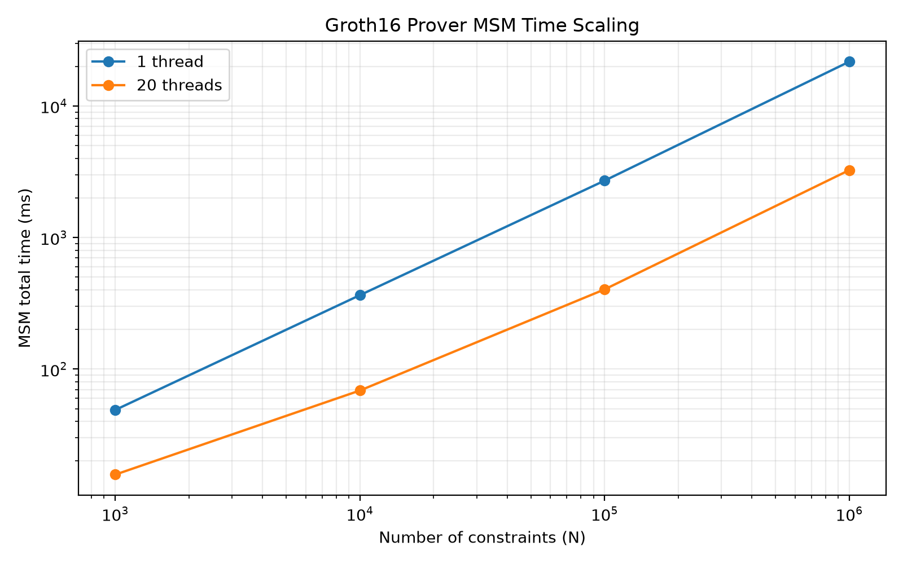

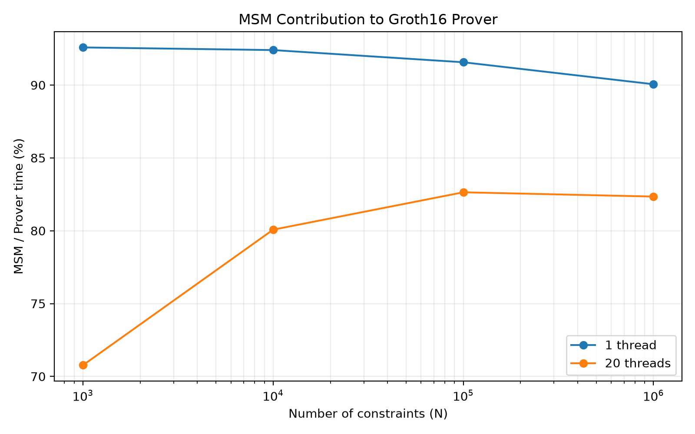

---

## MSM Parallel Scaling

The measured 1-thread to 20-thread speedups are:

| Constraints | Prover Speedup | MSM Speedup | B-G2 Speedup |
|---:|---:|---:|---:|
| 1,000 | 2.371× | 3.101× | 4.204× |
| 10,000 | 4.599× | 5.307× | 5.905× |
| 100,000 | 6.223× | 6.901× | 7.447× |
| 1,000,000 | 6.100× | 6.672× | 7.231× |

The 100,000-constraint configuration currently gives:

```text
Prover speedup ≈ 6.22×
MSM speedup    ≈ 6.90×
B-G2 speedup   ≈ 7.45×
```

These are well below ideal 20× linear scaling. The measurements therefore show clear non-ideal parallel behavior, but the total speedup alone does not identify its exact cause.

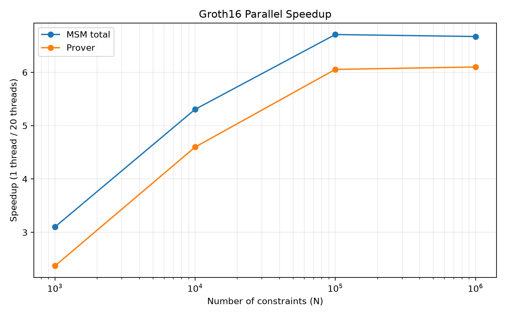

---

# Standalone MSM Microbenchmark

The standalone MSM benchmark measures variable-base MSM separately from the full Groth16 prover.

Tested groups:

```text
G1
G2
```

Tested sizes:

```text
2^10
2^12
2^14
2^16
```

Thread configurations:

```text
1 thread
20 threads
```

Each configuration uses 2 warm-up runs and 7 formal measurement runs. The reported summary uses the latest 5 formal runs from the selected complete session.

The current processed results are:

| Group | Threads | N | Median (ms) |
|---|---:|---:|---:|
| G1 | 1 | 1,024 | 7.108 |
| G1 | 1 | 4,096 | 22.051 |
| G1 | 1 | 16,384 | 76.592 |
| G1 | 1 | 65,536 | 262.892 |
| G1 | 20 | 1,024 | 2.811 |
| G1 | 20 | 4,096 | 6.066 |
| G1 | 20 | 16,384 | 14.106 |
| G1 | 20 | 65,536 | 42.584 |
| G2 | 1 | 1,024 | 22.398 |
| G2 | 1 | 4,096 | 72.043 |
| G2 | 1 | 16,384 | 234.917 |
| G2 | 1 | 65,536 | 800.915 |
| G2 | 20 | 1,024 | 5.542 |
| G2 | 20 | 4,096 | 14.296 |
| G2 | 20 | 16,384 | 36.776 |
| G2 | 20 | 65,536 | 109.493 |

G2 MSM is consistently more expensive than G1 MSM under the tested configurations.

The corresponding 1-thread to 20-thread speedups are:

| N | G1 Speedup | G2 Speedup |
|---:|---:|---:|
| 1,024 | 2.53× | 4.04× |
| 4,096 | 3.64× | 5.04× |
| 16,384 | 5.43× | 6.39× |
| 65,536 | 6.17× | 7.31× |

The results show that parallel execution becomes increasingly effective as the MSM workload becomes larger. However, the measured speedups remain well below the ideal 20× scaling corresponding to 20 threads.

At 20 threads, the measured G2/G1 execution-time ratio is:

```text
N = 1,024    → 1.97×
N = 4,096    → 2.36×
N = 16,384   → 2.61×
N = 65,536   → 2.57×
```

The G2/G1 gap remains substantial under parallel execution, although the ratio does not increase monotonically across all tested sizes.

At 1 thread, the corresponding G2/G1 ratios are:

```text
N = 1,024    → 3.15×
N = 4,096    → 3.27×
N = 16,384   → 3.07×
N = 65,536   → 3.05×
```

This shows that the higher cost of G2 MSM is not limited to parallel execution.

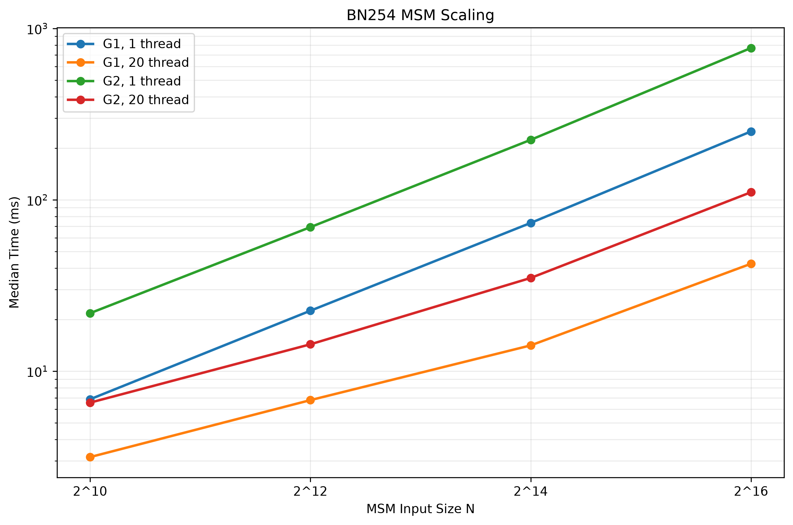

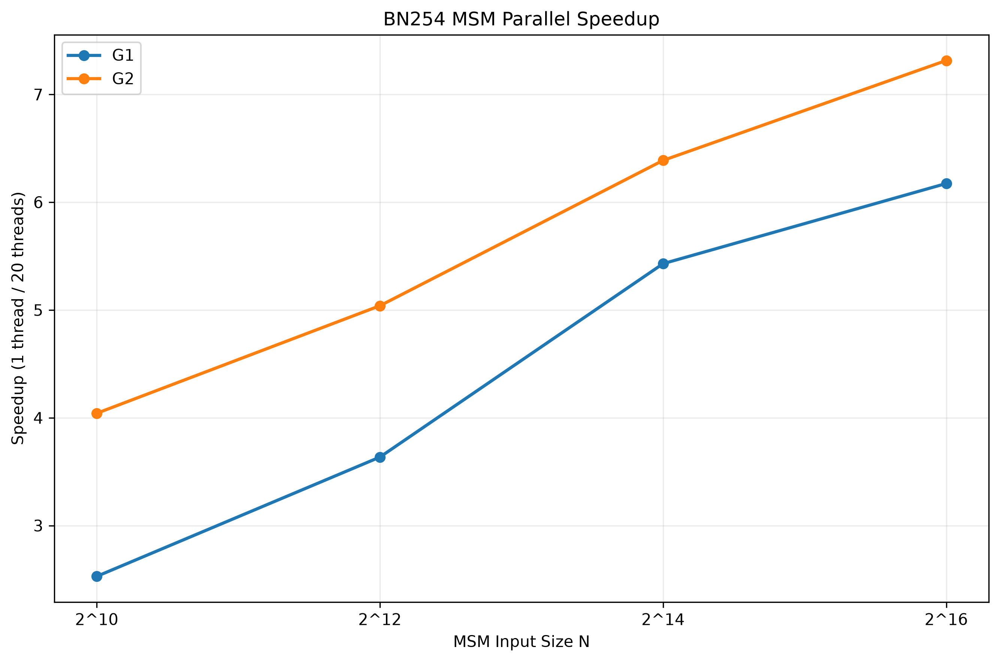

The processed table is [`results/tables/msm.csv`](results/tables/msm.csv).

The standalone MSM benchmark is summarized using:

```powershell
python scripts/summarize_msm.py
```

---

# G1 / G2 Group-Operation Microbenchmark

To understand why G2 MSM is more expensive, the next layer of analysis measures the group operations used by the WNAF bucket-processing path directly.

The experiment evaluates bucket updates over several bucket counts:

```text
256
2048
8192
32768
```

The tested G2/G1 ratio for mixed bucket updates is approximately:

| Bucket Count | G2 / G1 Mixed Update |
|---:|---:|
| 256 | 3.29× |
| 2,048 | 3.29× |
| 8,192 | 3.27× |
| 32,768 | 3.03× |

The results are broadly consistent with a roughly 3× higher cost for the tested G2 group updates, with some variation at large bucket counts.

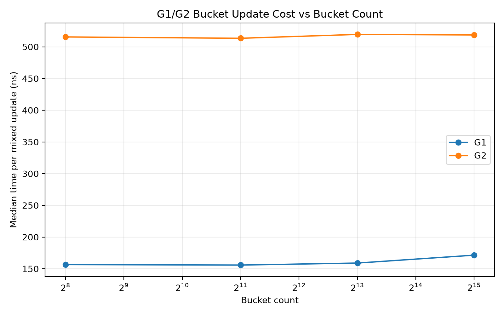

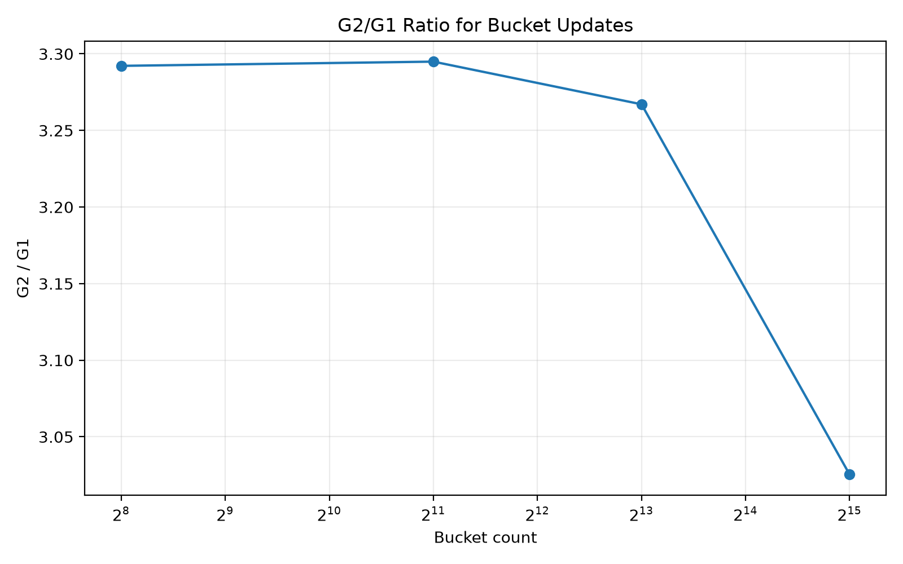

The processed results are:

- [`group_add_microbench.csv`](results/tables/group_add_microbench.csv)
- [`microbench_ratio_by_bucket.csv`](results/tables/microbench_ratio_by_bucket.csv)

---

# WNAF Internal Analysis

The standalone G1/G2 measurements explain why G2 group operations are individually more expensive, but they do not yet answer which part of the internal MSM loop dominates execution.

The current `vendor/ark-ec` implementation uses a WNAF-based variable-base MSM path. The relevant structure is approximately:

```text
MSM
 ↓
msm_signed()
 ↓
WNAF MSM path
 ↓
digit generation
 ↓
per-window bucket construction
 ↓
prefix reduction
 ↓
window recombination
```

For the current diagnostic experiment, the implementation was instrumented to record:

- digit-generation work;
- bucket-accumulation work;
- prefix-reduction work;
- window-level wall time;
- recombination overhead.

The trace is stored separately as:

```text
experiments/raw/msm_trace/trace_n100000_1t.txt
```

---

## N = 100,000, 1 Thread

For the B-G2 MSM, the typical measured cost is approximately:

```text
Total B-G2 MSM           ≈ 1165 ms
Bucket accumulation      ≈ 1034 ms
Prefix reduction         ≈ 112 ms
Remaining phases         ≈ small relative to the above
```

This gives an approximate internal time distribution of:

```text
Bucket accumulation      ≈ 88.6%
Prefix reduction         ≈ 9.6%
Other phases             ≈ 1–2%
```

The same qualitative shape is also visible for B-G1, where bucket accumulation remains the dominant internal component.

Therefore, the earlier hypothesis that prefix reduction might be the main B-G2 bottleneck is not supported by the final trace. **Bucket accumulation is the dominant B-G2 component in the tested 1-thread configuration.**

This is an important localization result because it narrows the optimization search from:

```text
"optimize MSM"
```

to a much more concrete problem:

```text
B-G2 MSM
    ↓
WNAF bucket processing
    ↓
Bucket accumulation
```

---

## Why the Ratio Is Important

The standalone microbenchmarks and the internal WNAF trace provide two independent pieces of evidence.

First, the G2 bucket-update microbenchmark is roughly 3× the G1 cost under the tested workload.

Second, the internal B-G2/B-G1 execution ratio is also around 3× in the single-thread configuration.

This agreement suggests that the higher cost of the B-G2 MSM is strongly related to the cost of the underlying G2 bucket operations, rather than being explained primarily by the prefix phase.

The result is consistent with the current source-level cost model, while still leaving room for additional effects from memory behavior, windowing, and parallel execution.

---

# WNAF Window / Bucket Scaling

The current WNAF implementation uses a window parameter that grows with MSM size. Under the tested implementation, the relevant bucket counts are approximately:

| MSM Size N | Window `c` | Bucket Count `2^c` |
|---:|---:|---:|
| 1,000 | 8 | 256 |
| 10,000 | 11 | 2,048 |
| 100,000 | 13 | 8,192 |
| 1,000,000 | 15 | 32,768 |

This matters because bucket-processing cost is affected by both the number of scalar updates and the amount of bucket state created for each window.

The group-operation and prefix microbenchmarks therefore use several bucket counts rather than assuming that one fixed bucket size represents all circuit scales.

---

# Prefix Microbenchmark

The prefix phase is measured independently to distinguish its cost from bucket accumulation.

The current G2/G1 prefix ratio is:

| Bucket Count | G2 / G1 Prefix |
|---:|---:|
| 256 | 3.97× |
| 2,048 | 3.59× |
| 8,192 | 3.65× |
| 32,768 | 2.93× |

The G2/G1 ratio of the prefix operation can therefore also be large, but the internal WNAF trace shows that **prefix reduction is not the dominant B-G2 component** because bucket accumulation takes most of the total time.

The ratio does not decrease or increase monotonically with bucket count, indicating that cache, memory, and runtime effects can influence the measured behavior at larger working-set sizes.

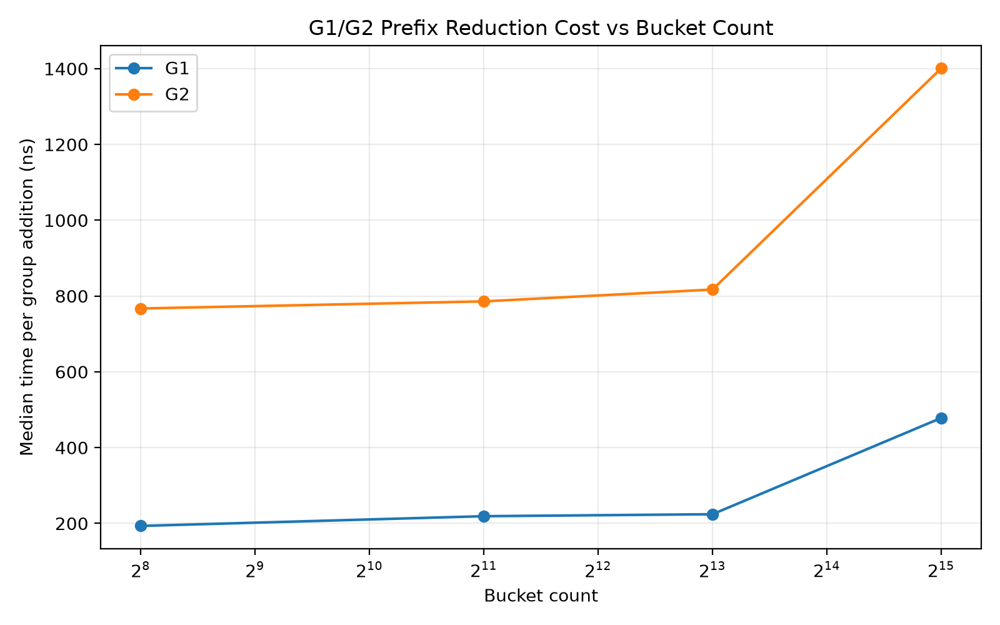

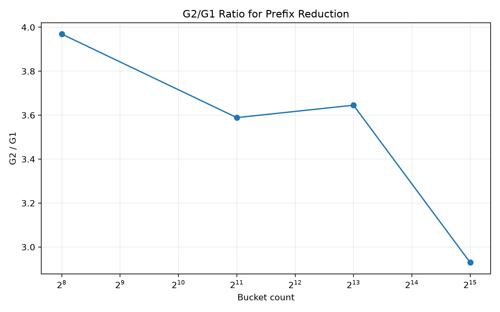

The processed prefix data are stored in [`results/tables/prefix_microbench.csv`](results/tables/prefix_microbench.csv).

---

# FFT / IFFT Microbenchmark

FFT and inverse FFT were measured as a contrast to MSM-heavy computation.

Tested domain sizes:

```text
2^10  = 1,024
2^12  = 4,096
2^14  = 16,384
2^16  = 65,536
```

Representative timing results are:

| N | Forward 1T (ms) | Forward 20T (ms) | Inverse 1T (ms) | Inverse 20T (ms) |
|---:|---:|---:|---:|---:|
| 1,024 | 0.138 | 0.306 | 0.151 | 0.455 |
| 4,096 | 0.700 | 0.761 | 0.703 | 0.823 |
| 16,384 | 2.798 | 1.171 | 2.932 | 1.252 |
| 65,536 | 11.872 | 2.790 | 12.955 | 3.083 |

The corresponding speedups show the same general systems effect seen elsewhere: small workloads can be dominated by parallel overhead, while sufficiently large workloads benefit more clearly from parallel execution.

| N | Forward Speedup | Inverse Speedup |
|---:|---:|---:|
| 1,024 | 0.451× | 0.332× |
| 4,096 | 0.920× | 0.854× |
| 16,384 | 2.389× | 2.342× |
| 65,536 | 4.255× | 4.202× |

Thus, FFT is useful as a comparison point, but under the current benchmark it is not the primary low-level hotspot identified by the prover measurements.

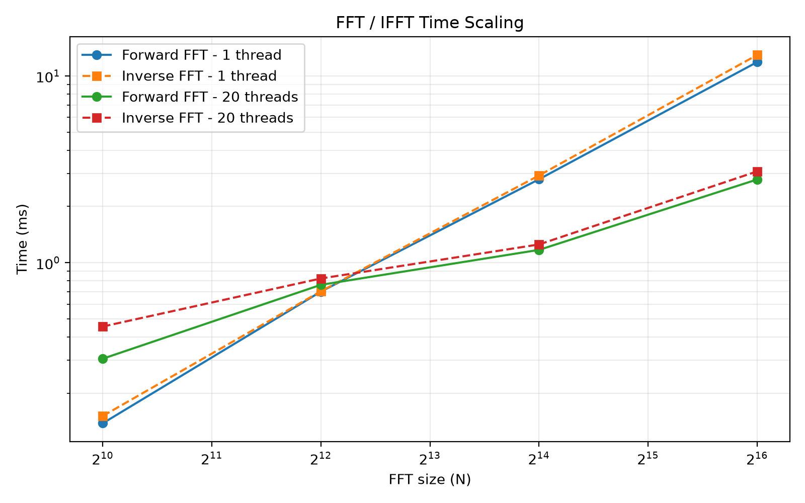

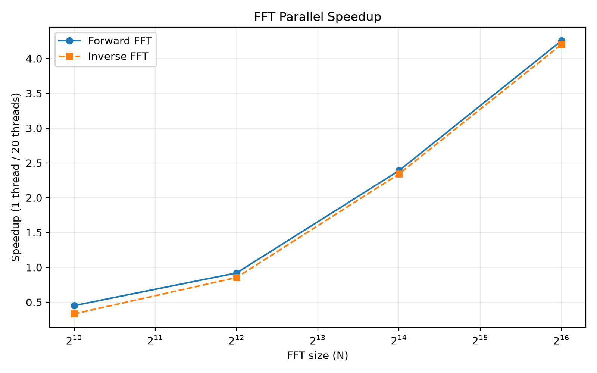

Processed FFT data:

- [`fft_summary.csv`](results/tables/fft_summary.csv)
- [`fft_speedup.csv`](results/tables/fft_speedup.csv)

---

# Thread Scaling Experiment

A dedicated prove-only thread-scaling experiment was used to separate scaling behavior from one fixed 1-thread/20-thread comparison.

For `N = 100,000` constraints:

| Threads | Prove (ms) | MSM (ms) | Prove Speedup | MSM Speedup | MSM Share |
|---:|---:|---:|---:|---:|---:|
| 1 | 3003.423 | 2753.481 | 1.000× | 1.000× | 91.68% |
| 2 | 1539.759 | 1388.973 | 1.951× | 1.982× | 90.21% |
| 4 | 895.387 | 790.277 | 3.354× | 3.484× | 88.26% |
| 8 | 598.051 | 510.853 | 5.022× | 5.390× | 85.42% |
| 12 | 604.115 | 511.573 | 4.972× | 5.382× | 84.68% |
| 16 | 533.568 | 445.080 | 5.629× | 6.186× | 83.42% |
| 20 | 501.156 | 414.052 | 5.993× | 6.650× | 82.62% |

The curve is clearly sublinear. Performance improves rapidly at first and then shows diminishing returns.

An important observation is that MSM itself scales somewhat better than the complete prover. This means that improving MSM alone cannot be expected to produce the same proportional improvement for end-to-end proving.

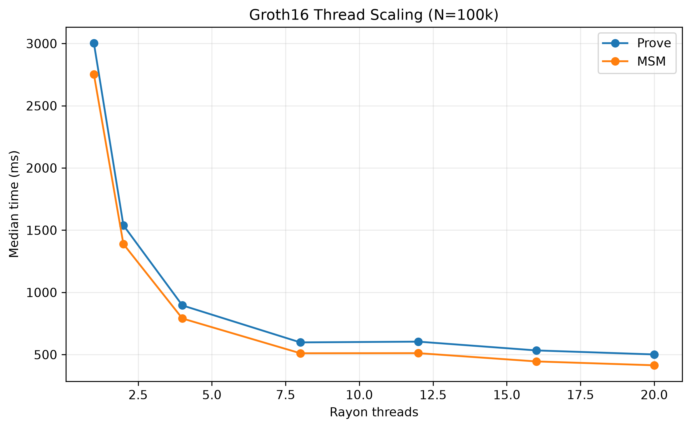

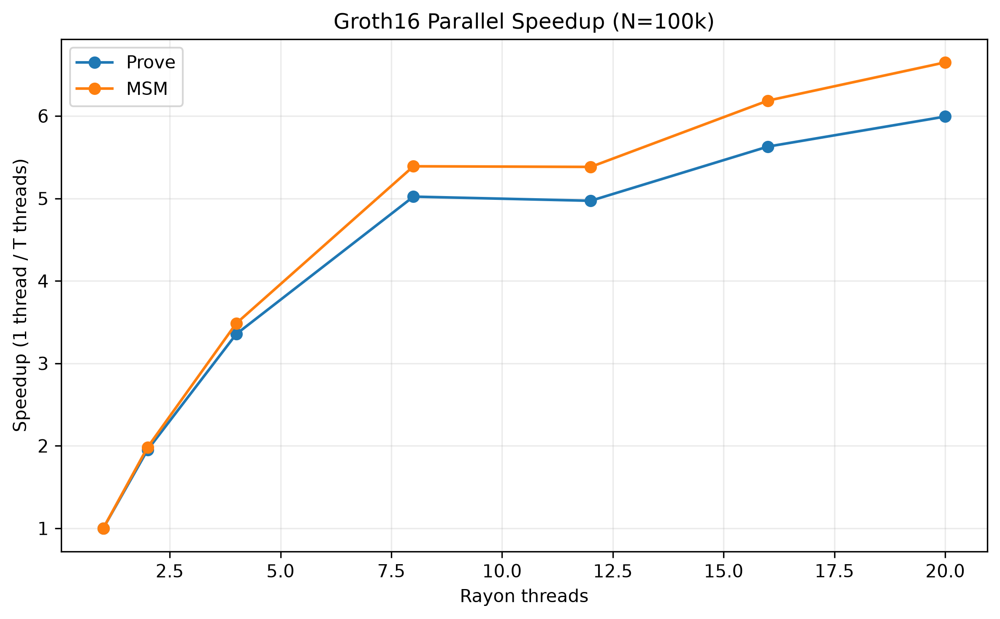

The raw experiment is stored in [`experiments/raw/thread_scaling/prove_scaling.csv`](experiments/raw/thread_scaling/prove_scaling.csv).

---

# Bottleneck Interpretation

The current experiments support the following interpretation.

### 1. The prover is MSM-dominated

Across the tested circuit sizes, the measured MSM operations consume most of prover execution time, especially in the single-thread configuration.

### 2. B-G2 is the largest individual MSM

Among the five instrumented MSMs, B-G2 is consistently the largest single component and contributes roughly 40% of total measured MSM time at larger scales.

### 3. The B-G2 hotspot is inside WNAF bucket accumulation

The internal trace shows that the majority of B-G2 time is spent updating WNAF buckets, not performing the prefix reduction.

### 4. G2 group operations explain a substantial part of the cost difference

The standalone group-operation benchmark shows that the corresponding G2 bucket updates are around 3× more expensive than their G1 counterparts under the tested workload.

### 5. Parallel scaling is non-ideal

The thread-scaling experiment shows strong improvement from 1 to 20 threads, but far from ideal linear speedup. At larger thread counts, remaining prover stages and system effects become increasingly important.

### 6. A microbenchmark speedup is not an end-to-end speedup

If one local primitive becomes 50% faster, the whole prover does not automatically become 50% faster. The end-to-end benefit is bounded by that primitive's share of total runtime and by the cost of all remaining stages.

---

# Current Research Candidate

The present evidence suggests the following concrete target:

```text
Groth16 Prover
    ↓
B-G2 MSM
    ↓
WNAF-based MSM
    ↓
Bucket accumulation
```

This target is intentionally narrower than “optimize MSM”.

The next research question is not yet “which optimization wins?”, but rather:

> **Why is the current G2 WNAF bucket accumulation expensive, and which algorithmic or systems-level changes can reduce that cost without causing an unacceptable increase elsewhere?**

Possible future investigation dimensions include:

- bucket representation and data layout;
- point-addition strategy;
- memory locality and cache behavior;
- WNAF window selection;
- batching or aggregation of bucket updates;
- parallel scheduling and chunking;
- alternative MSM algorithms or implementations;
- trade-offs between arithmetic work and memory traffic.

These are investigation directions, not claims that one specific technique will be superior.

---

# Repository Structure

```text
groth16-baseline/
├── .gitignore
├── Cargo.toml
├── Cargo.lock
├── README.md
├── rust-toolchain.toml
│
├── docs/
│   ├── bottleneck_analysis.md
│   ├── environment.md
│   ├── methodology.md
│   └── msm_analysis.md
│
├── experiments/
│   └── raw/
│       ├── auxiliary/
│       │   ├── baseline_n1000000_smoke.csv
│       │   ├── memory_n1000.csv
│       │   ├── memory_n10000.csv
│       │   ├── memory_n100000.csv
│       │   └── memory_n1000000.csv
│       │
│       ├── baseline/
│       |   ├── baseline_n1000.csv
│       |   ├── baseline_n10000.csv
│       |   ├── baseline_n100000.csv
│       │   ├── baseline_n1000000.csv
|       |   ├── baseline_n1000000.err
|       |   ├── memory_n1000.csv
|       |   ├── memory_n1000.err
|       |   ├── memory_n10000.csv
|       |   ├── memory_n10000.err
|       |   ├── memory_n100000.csv
|       |   ├── memory_n100000.err
|       |   └── peak_memory.csv
│       │
│       ├── microbench/
│       │   ├── fft.csv
│       │   ├── group_add.csv
│       │   ├── msm_g1.csv
│       │   ├── msm_g2.csv
│       │   └── prefix.csv
│       │
│       ├── msm_trace/
│       │   ├── msm_breakdown.csv
│       │   └── trace_n100000_1t.txt
│       │
│       ├── prover/
│       │   ├── prover_n1000.csv
│       │   ├── prover_n1000.err
│       │   ├── prover_n10000.csv
│       │   ├── prover_n10000.err
│       │   ├── prover_n100000.csv
│       │   ├── prover_n100000.err
│       │   ├── prover_n1000000.csv
│       │   └── prover_n1000000.err
│       │
│       └── thread_scaling/
│           └── prove_scaling.csv
│
├── results/
│   ├── figures/
│   │   ├── b_g2_msm_share.png
│   │   ├── fft_parallel_speedup.png
│   │   ├── fft_time_scaling.png
│   │   ├── group_add_g2_over_g1.png
│   │   ├── group_add_microbench.png
│   │   ├── msm_microbench.png
│   │   ├── msm_parallel_speedup.png
│   │   ├── msm_prover_ratio.png
│   │   ├── msm_speedup.png
│   │   ├── msm_time_scaling.png
│   │   ├── prefix_g2_over_g1.png
│   │   ├── prefix_microbench.png
│   │   ├── prove_time_vs_constraints.png
│   │   ├── prover_stage_breakdown.png
│   │   ├── prover_stage_share.png
│   │   ├── prover_time_vs_constraints.png
│   │   ├── thread_scaling_speedup.png
│   │   └── thread_scaling_time.png
│   │
│   └── tables/
│       ├── baseline_summary.csv
│       ├── fft_speedup.csv
│       ├── fft_summary.csv
│       ├── group_add_microbench.csv
│       ├── microbench_ratio_by_bucket.csv
│       ├── msm.csv
│       ├── msm_breakdown_summary.csv
│       ├── msm_speedup.csv
│       ├── prefix_microbench.csv
│       ├── prover_scaling.csv
│       |── prover_stage_share.csv
|       ├── prover_summary.csv
|       ├── prover_summary.md
|       ├── thread_scaling.csv
|       └── thread_scaling_selected_runs.csv
│
├── scripts/
│      ├── analyze_fft.py
│      ├── analyze_microbench.py
│      ├── analyze_msm.py
│      ├── analyze_performance.py
│      ├── plot_baseline.py
│      ├── plot_msm.py
│      ├── plot_msm_speedup.py
│      ├── plot_prover_profile.py
│      ├── requirements.txt
│      └── summarize_msm.py
│
├── src/
│   ├── bin/
│   │   ├── fft_microbench.rs
│   │   ├── group_add_microbench.rs
│   │   ├── inspect_sizes.rs
│   │   ├── microbench.rs
│   │   └── prefix_microbench.rs
│   ├── benchmark.rs
│   ├── circuit.rs
│   ├── groth16.rs
│   └── main.rs
│
└── vendor/
    ├── ark-ec/
    └── ark-groth16/
```

The large vendored Arkworks trees are omitted above at the file level and are represented by their top-level directories.

---

# Data Management

The repository separates data by processing stage:

```text
experiments/raw/
        ↓
Original Measurements
        ↓
scripts/*.py
        ↓
results/tables/
        ↓
Processed Summaries
        ↓
results/figures/
```

The intended rules are:

- `experiments/raw/` contains original measurements and diagnostic traces;
- `results/tables/` contains processed and summarized data;
- `results/figures/` contains generated figures;
- `docs/` contains methodology and interpretation notes.

For the standalone MSM benchmark specifically:

```text
experiments/raw/microbench/msm_g1.csv
experiments/raw/microbench/msm_g2.csv
        ↓
scripts/summarize_msm.py
        ↓
results/tables/msm.csv
        ↓
scripts/plot_msm.py
scripts/plot_msm_speedup.py
        ↓
results/figures/msm_microbench.png
results/figures/msm_speedup.png
```

Raw measurements should not be silently replaced by processed results.

---

# Reproducing the Main Benchmark

The repository currently contains multiple binaries. Use an explicit binary name when running the main benchmark.

For the 20-thread configuration:

```powershell
$env:RAYON_NUM_THREADS=20

cargo run --release --bin groth16-baseline -- bench 1000 2 5
cargo run --release --bin groth16-baseline -- bench 10000 2 5
cargo run --release --bin groth16-baseline -- bench 100000 2 5
cargo run --release --bin groth16-baseline -- bench 1000000 2 5
```

For the 1-thread configuration:

```powershell
$env:RAYON_NUM_THREADS=1

cargo run --release --bin groth16-baseline -- bench 1000 2 5
cargo run --release --bin groth16-baseline -- bench 10000 2 5
cargo run --release --bin groth16-baseline -- bench 100000 2 5
cargo run --release --bin groth16-baseline -- bench 1000000 2 5
```

After collecting MSM trace data, regenerate the processed summary with:

```powershell
python scripts/analyze_msm.py
```

---

# Reproducing the FFT Benchmark

Build and run the FFT microbenchmark explicitly:

```powershell
cargo build --release --bin fft_microbench
```

Example:

```powershell
$env:RAYON_NUM_THREADS=20

cargo run --release --bin fft_microbench -- 1024 2 7
cargo run --release --bin fft_microbench -- 4096 2 7
cargo run --release --bin fft_microbench -- 16384 2 7
cargo run --release --bin fft_microbench -- 65536 2 7
```

The raw data are stored in:

```text
experiments/raw/microbench/fft.csv
```

---

# Python Dependencies

Before running the analysis and plotting scripts, install the required Python packages:

```powershell
python -m pip install -r scripts/requirements.txt
```


# Reproducing the MSM Microbenchmarks

Standalone MSM measurements are stored in:

```text
experiments/raw/microbench/msm_g1.csv
experiments/raw/microbench/msm_g2.csv
```

The standalone benchmark can be run with:

```powershell
$env:RAYON_NUM_THREADS=1

cargo run --release --bin microbench -- g1 1024
cargo run --release --bin microbench -- g1 4096
cargo run --release --bin microbench -- g1 16384
cargo run --release --bin microbench -- g1 65536

cargo run --release --bin microbench -- g2 1024
cargo run --release --bin microbench -- g2 4096
cargo run --release --bin microbench -- g2 16384
cargo run --release --bin microbench -- g2 65536
```

For the 20-thread configuration:

```powershell
$env:RAYON_NUM_THREADS=20

cargo run --release --bin microbench -- g1 1024
cargo run --release --bin microbench -- g1 4096
cargo run --release --bin microbench -- g1 16384
cargo run --release --bin microbench -- g1 65536

cargo run --release --bin microbench -- g2 1024
cargo run --release --bin microbench -- g2 4096
cargo run --release --bin microbench -- g2 16384
cargo run --release --bin microbench -- g2 65536
```

The standalone MSM summary is generated with:

```powershell
python scripts/summarize_msm.py
```

The standalone MSM figures are generated with:

```powershell
python scripts/plot_msm.py
python scripts/plot_msm_speedup.py
```

Group-operation and WNAF-prefix measurements are stored in:

```text
experiments/raw/microbench/group_add.csv
experiments/raw/microbench/prefix.csv
```

Their processed results are generated with:

```powershell
python scripts/analyze_microbench.py
```

The MSM internal trace summary is regenerated with:

```powershell
python scripts/analyze_msm.py
```

---

# Interpretation and Reproducibility Principles

## Empirical measurements are implementation-specific

The reported timings describe the current implementation on the current hardware under the documented runtime configuration. They are not theoretical complexity results.

## Local bottlenecks must be connected back to the full prover

A primitive-level improvement is meaningful only when its local gain is related to its share of total prover time and then verified at the end-to-end level.

## Hardware and runtime effects matter

Performance can be affected by:

- CPU architecture;
- cache and memory hierarchy;
- memory bandwidth;
- SIMD/vectorization;
- thread scheduling;
- Rayon runtime overhead;
- finite-field implementation;
- elliptic-curve implementation;
- MSM window selection;
- data layout.

## Independent experiment stages are not numerically interchangeable

The baseline benchmark, coarse-grained profiling, standalone microbenchmarks, and internal WNAF traces are separate datasets. Their absolute timing values can differ because they were collected at different times and under different harness conditions.

The analysis therefore emphasizes reproducible trends, ratios, and cost attribution rather than assuming identical absolute timing across all files.

## Preserve the baseline before optimization

Future optimization experiments should keep a reference to the current baseline and report at least:

```text
Baseline
vs.
Optimized Version
```

under matched:

```text
Circuit
Curve / Field
Hardware
Compiler / Build Mode
Thread Configuration
Warm-up Policy
Measurement Policy
```

---

# Research Roadmap

The current repository naturally leads to the following next stage:

```text
Current Baseline
      ↓
B-G2 WNAF Bucket Accumulation
      ↓
Source / Memory / Arithmetic Investigation
      ↓
Optimization Hypothesis
      ↓
Microbenchmark Prototype
      ↓
Correctness Validation
      ↓
End-to-End Groth16 Benchmark
      ↓
Cross-Scale Evaluation
      ↓
Trade-off Analysis
```

A future optimization should answer three questions simultaneously:

1. **What changed?** — algorithm, data layout, arithmetic strategy, or parallel execution.

2. **What became cheaper?** — the exact local operation and measured cost reduction.

3. **What happened to the whole prover?** — end-to-end speed, memory, proof size, and any regression elsewhere.

---

# Summary of Current Findings

The current experimental baseline supports the following conclusions:

1. **MSM is the dominant low-level computational component of the tested Groth16 prover.**

2. **B-G2 is consistently the largest individual MSM instance and contributes roughly 40% of total measured MSM time at larger scales.**

3. **G2 group operations are substantially more expensive than G1 operations under the tested environment, with bucket-update ratios around 3×.**

4. **The internal WNAF trace localizes most B-G2 time to bucket accumulation rather than prefix reduction.**

5. **MSM parallelism scales better than some other prover work, but overall scaling remains far below ideal linear speedup.**

6. **FFT / IFFT shows clear workload-size-dependent parallel behavior but is not the current primary hotspot.**

7. **No optimization has yet been applied; the present result is a reproducible baseline plus a localized research candidate.**

The repository is therefore ready to serve as a reference point for the next phase of Groth16 optimization research.