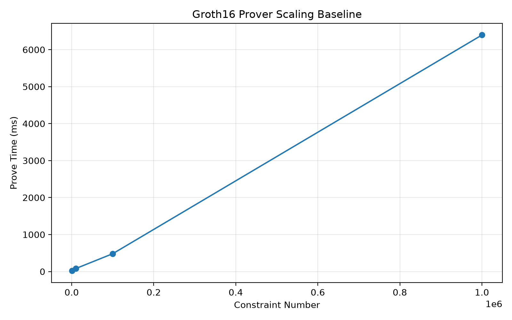

# Groth16 Baseline

A reproducible experimental baseline for the Groth16 zkSNARK proving system.

## Research Objective

This repository establishes a controlled Groth16 baseline for subsequent
profiling and optimization research.

The current experiments focus on:

- Setup Time
- Witness Generation Time
- Verifying-Key Preparation Time
- Prove Time
- Verify Time
- Proof Size
- Peak Working Set
- Constraint Scaling

## Experimental Environment

| Item | Value |
|---|---|
| CPU | Intel Core i7-14700 |
| Physical Cores | 20 |
| Logical Processors | 28 |
| RAM | 32 GB |
| OS | Windows 11 Home China Insider Preview |
| OS Version | 25H2 |
| OS Build | 26220.9568 |
| Rust | 1.98.1 |
| Target | x86_64-pc-windows-msvc |
| Arkworks | 0.6.0 |
| Curve | BN254 |
| Build | Release |
| Rayon Threads | 20 |

## Benchmark Protocol

For each circuit size:

- 2 warm-up runs
- 5 formal measurement runs
- Median used for timing summary

Witness generation, Setup, VK preprocessing, Prove, and Verify are measured
separately.

Proof size is measured after compressed serialization.

Peak Working Set is measured separately during one independent run.

## Baseline Results

| Constraints | Setup (ms) | Witness (ms) | Prepare VK (ms) | Prove (ms) | Verify (ms) | Proof (B) | Peak Memory (MB) |
|---:|---:|---:|---:|---:|---:|---:|---:|
| 1,000 | 11.242 | 0.023 | 1.050 | 20.394 | 1.128 | 128 | 11.29 |
| 10,000 | 61.102 | 0.162 | 0.928 | 80.503 | 0.976 | 128 | 23.46 |
| 100,000 | 442.122 | 1.533 | 0.845 | 481.373 | 0.857 | 128 | 114.75 |
| 1,000,000 | 6236.741 | 34.445 | 1.168 | 6394.521 | 1.335 | 128 | 892.23 |

## Prover Scaling



## Repository Structure

```text
groth16-baseline/
├── docs/
│   ├── environment.md
│   └── methodology.md
├── experiments/
│   └── raw/
├── results/
│   ├── figures/
│   └── tables/
├── scripts/
├── src/
│   ├── benchmark.rs
│   ├── circuit.rs
│   ├── groth16.rs
│   └── main.rs
├── Cargo.toml
├── Cargo.lock
├── README.md
└── rust-toolchain.toml